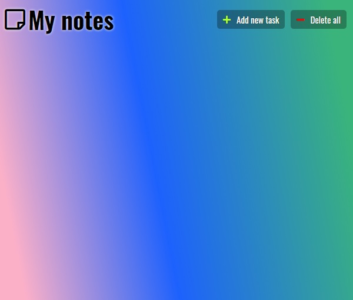

# NotesApp

## Demo

[**click live demo of the project**](https://dominiksiejka.github.io/BillSplitterApp)



## Table of Contents

- [About the Project](#description)
- [How to use](#how-to-use)
- [Technologies used](#built-with)
- [Setup steps](#setup)
- [Sources](#sources)
- [License](#license)

## Description

NotesApp it enables you to make short notes, so that you don't have to worry if you forget something important. You can create a note, delete all notes, edit a note or delete single note. The notes are also saved in the local storage of the browser, so you don't loose any data when you close the tab.

## How to use

There are two buttons at the top of the screen first is a 'add new task' and the second is 'delete all'. So when you press the first one the note creator will pop up, fill in all necessary informations and submit the form after a second or so the note will be added also it will be added to the local storage of the browser. To edit single task click the edit brush button at the top of the single note and then submit. To delete single task click the delete button on the task. To clear all note click the 'delete all' button which i have mentioned before. Deletion of single or all tasks, also removes the tasks form the local storage.

## Built with

- HTML5
- CSS
- Vanilla JavaScript

## Setup

```
with BASH

# clone the remote repo to your local one
$ git clone https://github.com/dominiksiejka/BillSplitterApp.git

# open the index.html file or use your code editor to open it with live server

```

## Sources

- Icons from [Font Awesome ](https://fontawesome.com)
- Font from [Google Fonts ](https://fonts.google.com/)

## License

- MIT © [Dominik Siejka ](https://github.com/dominiksiejka/BillSplitterApp)
